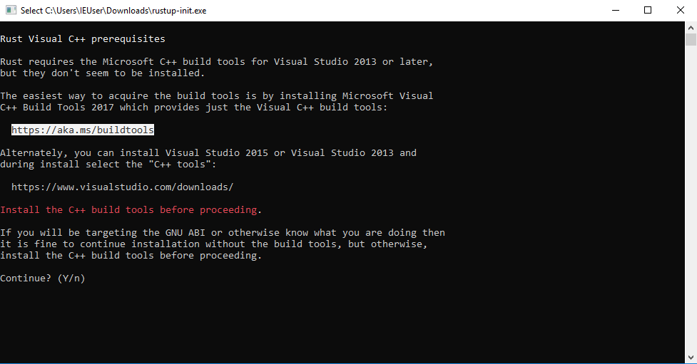
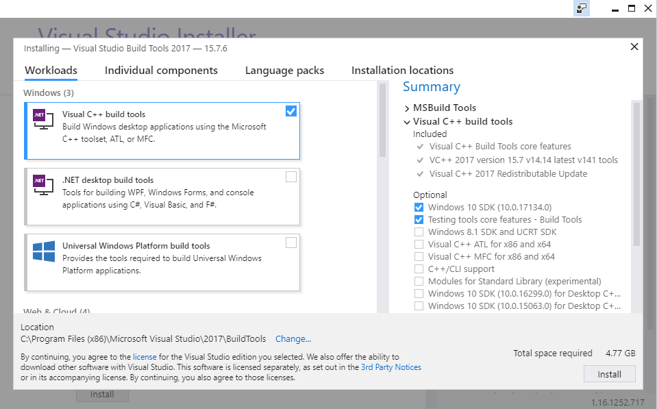
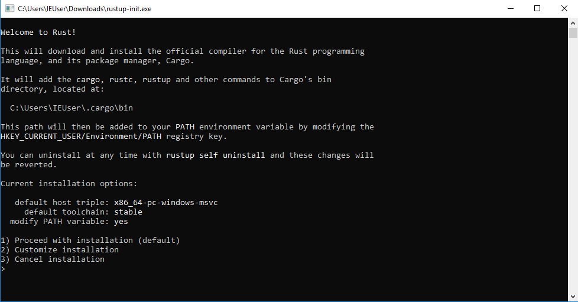
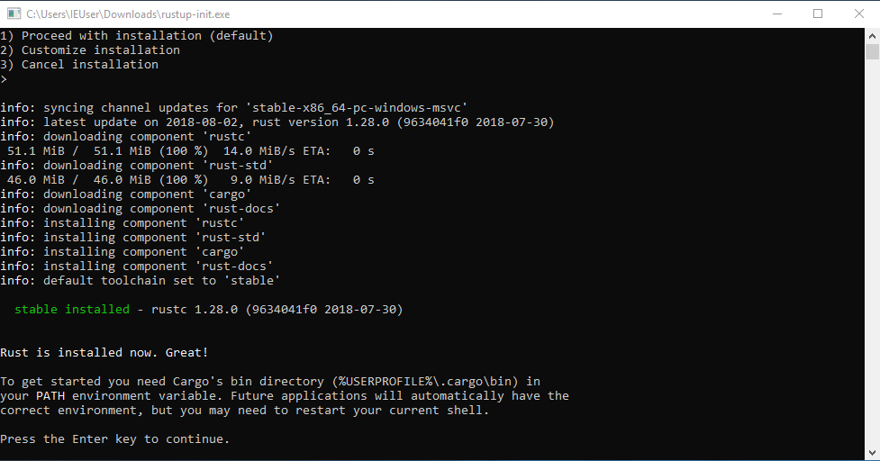

# Xori - Custom disassembly framework

[](https://www.gnu.org/licenses/agpl-3.0)


Xori is an automation-ready disassembly and static analysis library that consumes shellcode or PE binaries and provides triage analysis data.

## Architectures:
* i386
* x86-64

## File Formats
* PE, PE+
* Plain shellcode

## Current Features
* Outputs json of the 1) Disassembly, 2) Functions, and 3) Imports.
* Manages Image and Stack memory.
* 2 modes:
  * Light Emulation - meant to enumerate all paths (Registers, Stack, Some Instructions).
  * Full Emulation - only follows the code’s path (Slow performance).
* Simulated TEB & PEB structures.
* Evaluates functions based on DLL exports.
* Displays strings based on referenced memory locations.
* Uses FLIRT style signatures (Fast Library Identification and Recognition Technology).
* Allows you to use your own exports for simulating the PEB.
* Will detect padding after a non-returning call.
* Will try to identify function references from offsets.

What it doesn't do yet:
* The engine is interactive.
* Does not dump strings.
* Does not process non-executable sections.
* TEB and PEB are not enabled for non-pe files.
* Only some x86 instructions are emulated, not all.
* Patching and assembling.
* No plugins or scripting.


## [Documentation](doc/xori/)

## Requirements
rustc 1.27.0

### Install rust for OSX & Linux Distros

```
curl https://sh.rustup.rs -sSf | sh
```

### Install rust for Windows

First get the _rustup.exe_ (the rust toolchain installer) from [here](https://www.rust-lang.org/en-US/other-installers.html#other-ways-to-install-rustup).

This tool will install the rust compiler **rustc**, the rust package manager **cargo** and other usefull tools for development in rust.

* run the _rustup.exe_

#### Install rust prerequisites

in case you see this output, your Windows environment is missing the **Build Tools for Visual Studio** so keep reading, otherwise go [here](####install-rust-toolchain)


* follow the link from the output, or click [here](https://aka.ms/buildtools)

* cancel the _rustup-init.exe_

* back in browser, scroll down, expand the tab **Tools for Visual Studio 2017** & download the **Build Tools for Visual Studio 2017**


* run the executable

choose the **Visual C++ build tools** & click "install", close the "Visual Studio Installer" after the installation


#### Install rust toolchain

run the _rustup.exe_ & you will see the following output


after the successful installation you can see that the rust compiler **rustc**, rust package manager **cargo** and other tools were installed (under `C:\Users\%username%\.cargo` & `C:\Users\%username%\.rustup`)


* open a new "Command Prompt" & follow the **xori** build steps [here](##1.-build-xori)

# Installation

## 1. Build Xori

This command will also create other binaries such as pesymbols ans peinfo.

```
git clone https://github.com/endgameinc/xori.git
cd xori
cargo build --release
```

## 2. Create xori.json config file

```
cp xori.json.example xori.json
[edit if desired]
```

## 3. (Optional) Build the symbols files

If you want to create your own symbol files you need to set the dll folders to where you stored your windows dlls. 

```
"function_symbol32": "./src/analysis/symbols/generated_user_syswow64.json",
"function_symbol64": "./src/analysis/symbols/generated_user_system32.json",
"symbol_server": {
	"dll_folder32": "./dlls/32bit",
	"dll_folder64": "./dlls/64bit"
```

Run pesymbols to overwrite the function_symbol json

```
 ./target/release/pesymbols
```

# Run

```
./target/release/xori -f test.exe
```

## Run all tests

```
cargo test
```

# Browser GUI

Chrome | Firefox | Safari | IE | Opera
--- | --- | --- | --- | --- |
Latest ✔ | Latest ✔ | Latest ✔ | x | Latest ✔ |

## Requirements

nodejs

yarn (optional for UI dev)

- On Ubuntu 18.04 you may need to apt install the following: `curl git libssl-dev pkg-config build-essential npm`

## Build

```
cd gui
npm install
```

## Run

In one terminal
```
cd gui
node src/server.js
```
In another terminal
```
cd gui
npm start
```

It will open your default browser to http://localhost:3000/.
The backend API is listening on localhost:5000.
